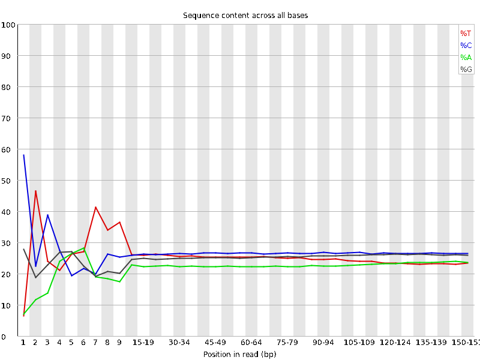
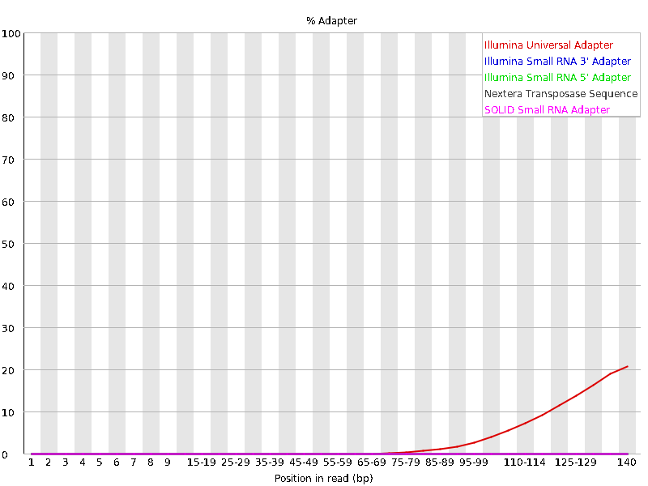
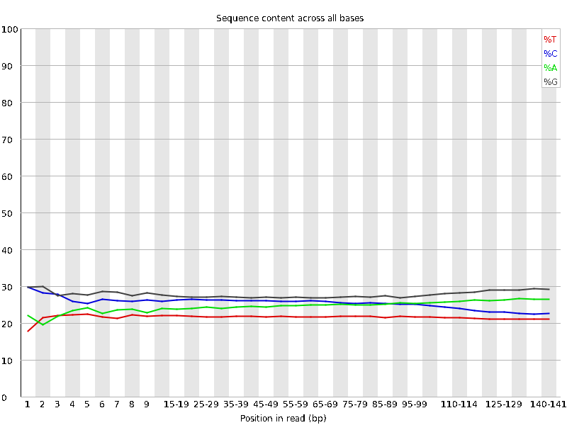
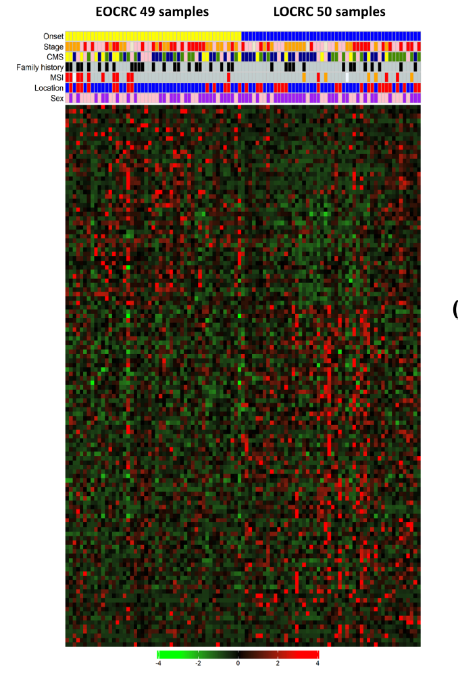
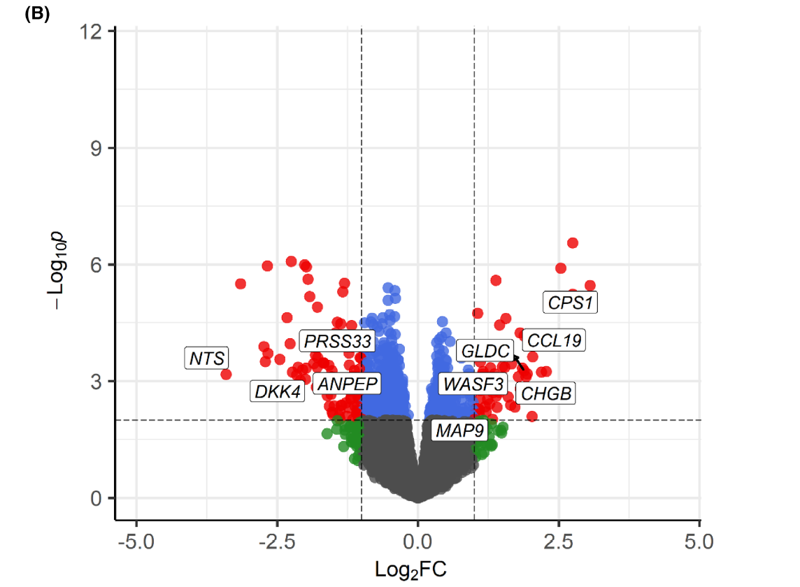

```{r setup, include=FALSE}
knitr::opts_chunk$set(echo = TRUE)
```

Introduction:

  Our analysis is based on the paper published by Ha et al. (2023) entitled: "Reduced expression of alanyl aminopeptidase is a robust biomarker of non-familial adenomatous polyposis and non-hereditary nonpolyposis colorectal cancer syndrome early-onset colorectal cancer" (https://doi.org/10.1002/cam4.5675). The authors have made their sequencing data (fastqs) and read counts file publicly available on the GEO datbase: https://www.ncbi.nlm.nih.gov/geo/query/acc.cgi?acc=GSE213092. We chose this analysis because it involved many concepts that we covered in class, but also went beyond these and required learning some new techniques. Cancer biomarker discovery is a research interest of Liam's lab, so this paper is relevant to potential projects he may carry out down the road.
  
  This study aimed to identify differential gene expression markers to distinguish early-onset colorectal cancer from late-onset colorectal cancer of the subtypes non-familial adenomatous	polyposis and	non-hereditary nonpolyposis.The group performed RNA-seq of 49 early-onset and 50 late-onset colorectal cancer samples. They analyzed differentially-expressed genes between these groups and filtered them based on log2FC, logCPM, and P-values. They validated the identified differentially-expressed genes using data from TCGA (The Cancer Genome Atlas) database, based on similar expression profiles. Based on this validation, they identified the gene analyl aminopeptidase (ANPEP) as significantly downregulated in early-onset colorectal cancer patients in both their cohort and the TCGA cohort. This association was further supported by methylation data and information from the GTEx and GSE196006 datasets. The study concluded that the gene ANPEP was significantly down-regulated in early-onset colorectal cancer, and could serve as a novel biomarker.
  
  The scope of our analysis is to carry out the methods described in section 2.2: Bulk RNA sequencing and data analysis. In these steps, the authors used the fastq files output from RNAseq to obtain normalized read counts, and used these to produce the heatmap shown in Figure 1A and the volcano plot shown in Figure 2B. These steps were used to identify genes that had significant differential expression between the early-onset and late-onset groups in the 99 patient samples. These steps precede the comparison with TCGA data that ultimately led the authors to single out ANPEP as a novel biomarker. 

Methods and Results:

Part I: Pre-processing fastqs to obtain read counts

To demonstrate the pre-processing steps for generating a read counts file from fastq files as performed by the authors, we use only 4 fastq files, two from the early-onset group and two from the late-onset group. As there are 99 samples with 2 fastq files each in the whole dataset, the analysis would be too time-consuming if we used all the available files.

The files are named as follows:

LateOnset_SRR21523090_pass_1.fastq.gz
LateOnset_SRR21523090_pass_2.fastq.gz

LateOnset_SRR21523091_pass_1.fastq.gz
LateOnset_SRR21523091_pass_2.fastq.gz

EarlyOnset_SRR21523117_pass_1.fastq.gz
EarlyOnset_SRR21523117_pass_2.fastq.gz

EarlyOnset_SRR21523118_pass_1.fastq.gz
EarlyOnset_SRR21523118_pass_2.fastq.gz


In the following script, we tried to carry out all pre-processing steps only for the sample EarlyOnset_SRR21523117.
We then incorporated all of these steps into a pipeline that could be used to process any number of samples.

1. Check quality of raw fastqs using fastqc

```{bash, eval=FALSE}

sample=EarlyOnset_SRR21523117
fastqc -o ./fastQC_output $sample"_pass_1.fastq.gz" $sample"__pass_2.fastq.gz"

```

As shown below, the fastq file failed the per base sequence content and adapter content quality metrics. This showed that we needed to trim adapters and indexes.




2. Trim adapters using cutadapt

This study used the TruSeq Stranded mRNA LT Sample Prep Kit to prepare samples.

According to the Illumina Adapter Sequences manual (Document # 1000000002694 v17 pg. 48):
https://support.illumina.com/downloads/illumina-adapter-sequences-document-1000000002694.html

The sequence that can be used for TruSeq universal adapter trimming is:

AATGATACGGCGACCACCGAGATCTACACTCTTTCCCTACACGACGCTCTTCCGATCT

The authors were not clear about the adapter sequences they used, but fastqc detected universal adapter sequences in this sample, so we will assume they used this sequence and use cutadapt to trim it.

```{bash, eval=FALSE}

# Trim adapters using cutadapt

sample=EarlyOnset_SRR21523117

cutadapt --cut 10 -a AATGATACGGCGACCACCGAGATCTACACTCTTTCCCTACACGACGCTCTTCCGATCT -o $sample.trimmed._pass_1.fastq.gz $sample"_pass_1.fastq.gz"

cutadapt --cut 10 -a AATGATACGGCGACCACCGAGATCTACACTCTTTCCCTACACGACGCTCTTCCGATCT -o $sample.trimmed._pass_2.fastq.gz $sample"_pass_2.fastq.gz"

#Check the resulting fastq files for improvement in base quality

fastqc -o ./fastQC_output $sample.trimmed._pass_1.fastq.gz $sample.trimmed._pass_2.fastq.gz

```


Trimming improved the per base sequence content quality metric by removing the first 10 bases from the reads in the fastqs (as shown above), but the adapter content did not change, which means that a different adapter sequence was used. Since we do not know what this sequence was, we will move on and use the resulting trimmed fastqs for subsequent steps.

3. Align fastqs to hg38 reference genome using bowtie2 and convert to BAM file

```{bash, eval=FALSE}

# Paired-end alignment of trimmed fatsq files with the hg38 reference genome

sample=EarlyOnset_SRR21523117

bowtie2 -x /projects/bmeg/indexes/hg38/hg38_bowtie2_index -1 $sample.trimmed._pass_1.fastq.gz -2 $sample.trimmed._pass_2.fastq.gz -S $sample.aligned.sam

# Sam to Bam conversion using samtools:

samtools view -h -b -o $sample.aligned.bam $sample.aligned.sam

```

4. Produce a counts file using featureCounts

After this step, we should have a text file that displays the number of reads assigned to each given gene ID. This will tell us the expression levels of each gene.

```{bash, eval=FALSE}
#Download and unpack the subreads package
wget --no-check-certificate https://sourceforge.net/projects/subread/files/subread-2.0.4/subread-2.0.4-Linux-x86_64.tar.gz
tar zxvf subread-2.0.4-Linux-x86_64.tar.gz

#Add the bin folder to the $PATH so we can use featureCounts
export PATH=/home/lbrockley_bmeg23/subread-2.0.4-Linux-x86_64/bin:$PATH

#Copy the hg38 annotation file in the subreads folder to the final project file to use for annotation with featurecounts
cp hg38_RefSeq_exon.txt /home/lbrockley_bmeg23/final_project/
#Convert to the preferred file extension (saf)
cp hg38_RefSeq_exon.txt hg38_RefSeq_exon.saf

#Summarize and count paired-end reads:
sample=EarlyOnset_SRR21523117
featureCounts -p --countReadPairs -t exon -g gene_id -F 'SAF' -a hg38_RefSeq_exon.saf -o $sample.counts.txt $sample.aligned.bam

```

The output of this script is a read counts file with 28397 rows:

```{r}
EarlyOnset_SRR21523117_counts <- read.csv('EarlyOnset_SRR21523117.counts.csv')

```

The featureCounts program states that a total of 56732052 alignments occurred, and 21202936 (37.4%) of alignments were successfully assigned. It is likely that the performance of the alignment would have been better if we had removed the correct adapter sequences using cutadapt.

Once we had verified these steps for one sample, we incorporated them into a pipeline.

We made a task file called sample_names.txt, with the following contents:

LateOnset_SRR21523090
LateOnset_SRR21523091
EarlyOnset_SRR21523117
EarlyOnset_SRR21523118

We used the script runTheseJobsSerially from assignment 2, made a pipeline file called fastqToReadCounts.sh, and tested the pipeline as follows:

```{bash, eval=FALSE}
## Pipeline test

./runTheseJobsSerially.sh ./fastqToBam.sh sample_names.txt

```

```{bash, eval=FALSE}
##fastqToBam pipeline
#
set -e # this makes the whole script exit on any error.
sample=$1
logDir=MyLogDirectory # this is where all the files to keep track of progress will go.
mkdir -p MyLogDirectory # make the directory where log files will go, if it doesn't exist already
echo running pipeline for $sample
#
# Trim adapters from the fastq files:
#
# QC: Check the quality of reads in the fastq files using fastQC
#
if [ ! -e $logDir/$sample.fastqc.done ] #run this code only if record of fastqc is missing
then
        echo Performing fastqc of sample $sample with the following fastqs:
        ls $sample"_pass_1.fastq.gz" $sample"_pass_2.fastq.gz"
        fastqc -o ./fastQC_output $sample"_pass_1.fastq.gz" $sample"_pass_2.fastq.gz"
        touch $logDir/$sample.fastqc.done #create record to prevent repeating process on same file
else # $logDir/$sample.fastqc.done was not missing
        echo Already performed fastqc of $sample
fi
#
# Trim adapters using cutadapt:
#
if [ ! -e $logDir/$sample.trimming.done ] #run this code only if record is missing
then
        echo Performing cutadapt trim of sample $sample with the following fastqs:
        ls $sample"_pass_1.fastq.gz" $sample"_pass_2.fastq.gz"
        cutadapt --cut 10 -a AATGATACGGCGACCACCGAGATCTACACTCTTTCCCTACACGACGCTCTTCCGATCT -o $sample.trimmed._pass_1.fastq.gz $sample"_pass_1.fastq.gz"
        cutadapt --cut 10 -a AATGATACGGCGACCACCGAGATCTACACTCTTTCCCTACACGACGCTCTTCCGATCT -o $sample.trimmed._pass_2.fastq.gz     $sample"_pass_2.fastq.gz"
        touch $logDir/$sample.trimming.done #create record to prevent repeating process on same file
else # $logDir record was not missing
        echo Already performed cutadapt trim of $sample
fi
#
# Align reads to the hg38 reference genome using bowtie2 (the group used HISAT2 but these tools are comparable for RNASeq data):
#
if [ ! -e $logDir/$sample.alignment.done ] #run this code only if record of alignment is missing
then
        echo Performing bowtie2 alignment of sample $sample with the following fastqs:
        ls $sample"_pass_1.fastq.gz" $sample"_pass_2.fastq.gz"
        bowtie2 -x /projects/bmeg/indexes/hg38/hg38_bowtie2_index -1 $sample.trimmed_pass_1.fastq.gz -2 $sample.trimmed._pass_2.fastq.gz -S $sample.alignment.sam
        touch $logDir/$sample.alignment.done #create record to prevent repeating process on same file
else # $logDir record was not missing
        echo Already performed bowtie2 alignment of $sample
fi
#
#Convert SAM files to BAM files using samtools view:
#
if [ ! -e $logDir/$sample.sam_to_bam.done ] #run this code only if record of conversion is missing
then
        echo Performing conversion of sample $sample from .sam to .bam with the following .sam file:
        ls $sample.alignment.sam
        samtools view -h -b -o $sample.alignment.bam $sample.alignment.sam
        rm $sample.alignment.sam #Remove the unnecessary sam file
        touch $logDir/$sample.sam_to_bam.done #create record to prevent repeating process on same file
else # $logDir record was not missing
        echo Already performed conversion of .sam to .bam for $sample
fi
#
echo finished pipeline for $sample
```

We then ran featureCounts on all the BAM files generated.

```{bash, eval=FALSE}
featureCounts -p --countReadPairs -t exon -g gene_id -F 'SAF' -a hg38_RefSeq_exon.saf -o counts.txt *.bam

```


Part II: Analysis of read counts data to identify differentially expressed genes (DEG) between early-onset and late-onset groups

To replicate the steps which produced the heatmap in Figure 1A and volcano plot in Figure 2B, we use the read counts file available from the GEO database that had been generated from all the fastq files. We also compared plots produced using our filtered DEG list versus the filtered DEG list provided in supplementary appendix 1 by the authors.

Part II A: Generating a normalized DEG list from the read counts file

The code in section IIA was not allowing the Rmd file to be knit into a pdf file due to a unicode error, so we wrote "include=false" in the code chunk. The code we used to generate the DGE list is visible in the Rmd file but not in the knitted .pdf file.

```{r, include = FALSE}
library(readr)
library(dplyr)
library(tidyverse)

# Store the RNAseq read counts file as a dataframe
counts_data <- read_tsv('GSE213092_HRCRC_rowsort.txt')
counts_data <- as.data.frame(counts_data)
counts_data <- counts_data[!rowSums(is.na(counts_data)),] #Remove NA values from counts data

#NOTE: There were duplicate rows for genes labelled "01-Mar" and "02-Mar" in the original data.
#These seemed to be mislabeled, and were causing issues with downstream steps, so we decided to remove these rows.
#Ideally, we would find out why these genes were mislabeled and correctly identify them, but we do not have enough information to do that.
counts_data <- counts_data[counts_data$Gene != "01-Mar", ]
counts_data <- counts_data[counts_data$Gene != "02-Mar", ]

#Set the row names to be the gene names
row.names(counts_data) <- counts_data[,1]
counts_data <- counts_data[, -1]

# Convert the counts data into a format that DGEList will accept: integer matrix
dge_counts <- as.matrix(counts_data)
mode(dge_counts) <-"integer"

#Read in a table of sample labels, so each sample can be matched to disease state (early or late onset colon cancer)
sample_labels <- read.csv('sample_labels.csv')
sample_labels <- sample_labels[!rowSums(is.na(sample_labels)),] #Remove NA values
sample_labels_subset <- sample_labels[, c(8,16)] # Create list of sample names with early vs late onset, to be used later for the heatmap
sample_labels_subset <- sample_labels_subset[order(sample_labels_subset$disease_state),] # Sort the list
sample_labels_subset$EorL <- c(as.numeric(sample_labels_subset$disease_state == "Early-onset colorectal cancer")) #Used for sample labelling in the later heatmap

# Normalize read counts for every gene with the trimmed mean of M-values (TMM) method, using the edgeR package to create a DGEList object.
# 2 disease state groups: early-onset and late-onset colon cancer
library(edgeR)
dge <- DGEList(counts=dge_counts, samples = as.data.frame(colnames(dge_counts)), genes = rownames(counts_data), group = sample_labels$disease_state)
dge <- calcNormFactors(dge, method = "TMM")
dge_counts_normalized <- cpm(dge, log=TRUE) # Data frame of read counts normalized based on CPM and the TMM normalization factors, converted to log2
dge_counts_normalized_z_scores <- apply(dge_counts_normalized, 2, function(x) (x - mean(x)) / sd(x)) # Calculating Z-score for the counts

#Create GLM model for differential gene expression comparison
design <- model.matrix(~sample_labels$disease_state)
dge = estimateDisp(dge, design)
fit = glmQLFit(dge, design)
qlf = glmQLFTest(fit, coef=2) 
topTags(qlf, n=10, adjust.method="BH", sort.by="logFC", p.value=0.01) #Checking output

# Calculating FDR values for all the P-values using the same method as topTags
dge_fdr <- as.data.frame(p.adjust(qlf$table$PValue, method = "BH"))
colnames(dge_fdr) <- c("FDR")

# Creating a data frame of the DGE data that can be filtered as specified in the paper
dge_fc <- c(qlf$genes, qlf$table, dge_fdr)
dge_fc <- data.frame(dge_fc)
dge_fc[,2] <- dge_fc[,2] * -1 # The paper's supplementary table had fold-change values with opposite sign because FC comparison had been made in the opposite direction.

# Filter DGE data based on following criteria: 
# p < 0.01, |log2FC| >1, logCPM > 1
dge_fc_filtered <- dge_fc[which(dge_fc$PValue < 0.01),]
dge_fc_filtered <- dge_fc_filtered[which(dge_fc_filtered$logCPM > 1),]
dge_fc_filtered <- dge_fc_filtered[which(abs(dge_fc_filtered$logFC) > 1),]
#This narrowed the list of candidate genes from 33119 to 142

# Sort based on fold change values
dge_fc_filtered <- dge_fc_filtered[order(-dge_fc_filtered$logFC),]

# The authors have made their filtered DGE gene list available in supplementary appendix 1.
paper_dge_fc <- read.csv('cam45675-sup-0001-appendixs1.csv')
```

```{r}
head(paper_dge_fc) # Authors' filtered DEG list
```


```{r}
head(dge_fc_filtered) #Our filtered DEG list.
```

It appears that many genes match between our list and the authors' list, and the values in the corresponding columns are usually close. A notable difference is that the top 4 logFC candidates in our table (SFTA3, SFTPB, SFRP1, SLC5A8) and the bottom 4 (LYPD2, TSIX, ITLN2, and LOC102723453) are not in the authors' table. Some of these have very large |logFC| values (e.g. SFTA3: 6.796528, LYPD3: -8.039594). These 8 genes met the filtering criteria, so we think they should have been included in the analysis. Furthermore, these genes have very low FDR values, which further favors their inclusion. If the authors had other reasons to exclude these genes, we think that they should have mentioned them in the paper. For comparison, we provide heat maps based on both our DEG list and the authors' DEG list.

Part II B: Generating a heatmap of differentially expressed genes.

Figure 1 in the paper displays a heatmap of DEGs, comparing the early-onset to the late-onset sample groups.



```{r}
# Heat map 1: based on our DEG list
# To make a heatmap as in the paper, we need to have a matrix of z-scores for only the genes remaining in the filtered data
heatmap_data <- as.data.frame(cbind(rownames(dge_counts_normalized_z_scores), dge_counts_normalized_z_scores))
colnames(heatmap_data)[1] <- "Gene"
heatmap_data_subset <- heatmap_data[heatmap_data$Gene %in% dge_fc_filtered$genes, ] # Get the normalized counts of the genes from the filtered and sorted DGE list 
heatmap_data_subset <- heatmap_data_subset[match(dge_fc_filtered$genes, heatmap_data_subset$Gene), ] # Sort as per the DGE list
heatmap_data <- heatmap_data_subset
rm(heatmap_data_subset)
heatmap_data <- as.matrix(heatmap_data) #Convert to a matrix
heatmap_data <- heatmap_data[,-1] #No longer need genes column for matching
mode(heatmap_data) <-"numeric"

# Generate heatmap (as per Figure 1 in the paper) using complexheatmap package (Gu, Z. Complex Heatmap Visualization. iMeta 2022.)
library(ComplexHeatmap)
library(circlize)
my_colors <- colorRamp2(c(-4, 0, 4), c("green", "black", "red"))

#We tried to make column labels to denote whether a sample was from early or late onset group, but ran into issues with how this was displayed.
#
# onset_labels = HeatmapAnnotation(onset = sample_labels_subset$EorL,
#                                  col = list(onset = c("1" = "yellow", "0" = "blue")),
#                                  gp = gpar(col = "black"), show_legend = FALSE)

heatmap_ourList <- Heatmap(heatmap_data, heatmap_legend_param = list(title = ""), col = my_colors, 
        show_row_dend = FALSE, show_column_dend = FALSE,
        row_order = rownames(heatmap_data), column_order = sample_labels_subset$X.1)

heatmap_ourList
```


In this heatmap, we have plotted the z-scores (as discussed) for the cpm gene expression values of our top logFC ranked genes for all patient samples. We have sorted the patient samples into early-onset (left) and late-onset (right).We have left the sample names and gene names in the heatmap, so that it can be verified that the samples are sorted into early and late-onset groups (left half: early-onset, right half: late-onset), and the gene list matches our gene list. 

It appears that in both our heatmap and the heatmap shown in the paper, there are differences in expression between the early- and late-onset cohorts. Both heatmaps have higher expression levels visible in the top left and bottom right quadrants, and lower expression in the bottom left and top right quadrants. This gives some evidence that we correctly selected genes that were differentially expressed between early-onset and late-onset groups. However, there are some genes in our list with high expression across all samples that overwhelm the signal, and there appear to be no genes with z-scores below -2 in our heatmap. To determine whether the issue is with the list of genes we used, we made another heatmap using the DEG list from the authors' appendix table 1.


```{r}
#Second heatmap, based on authors' DEG list:
#As before, for the heatmap input, we make a matrix of z scores, this time for only the genes in the authors' gene list
heatmap_authorList_data <- as.data.frame(cbind(rownames(dge_counts_normalized_z_scores), dge_counts_normalized_z_scores))
colnames(heatmap_authorList_data)[1] <- "Gene"
heatmap_authorList_data_subset <- heatmap_authorList_data[heatmap_authorList_data$Gene %in% paper_dge_fc$Gene, ] # Get the normalized counts of the genes from the paper's DGE list 
heatmap_authorList_data_subset <- heatmap_authorList_data_subset[match(paper_dge_fc$Gene, heatmap_authorList_data_subset$Gene), ] # Sort as per the DGE list
heatmap_authorList_data <- heatmap_authorList_data_subset
rm(heatmap_authorList_data_subset)
heatmap_authorList_data <- as.matrix(heatmap_authorList_data) #Convert to a matrix
heatmap_authorList_data <- heatmap_authorList_data[,-1] #No longer need genes column for matching
mode(heatmap_authorList_data) <-"numeric"

# For the paper's data, generate heatmap (as per Figure 1 in the paper) using complexheatmap package (Gu, Z. Complex Heatmap Visualization. iMeta 2022.)
library(ComplexHeatmap)
library(circlize)
my_colors <- colorRamp2(c(-4, 0, 4), c("green", "black", "red"))

heatmap_authorList <- Heatmap(heatmap_authorList_data, heatmap_legend_param = list(title = ""), col = my_colors, 
                     show_row_dend = FALSE, show_column_dend = FALSE,
                     row_order = rownames(heatmap_authorList_data), column_order = sample_labels_subset$X.1,
                     #top_annotation = onset_labels,
                     cluster_columns = FALSE)
heatmap_authorList
```

In general, this heatmap looks quite similar to the heatmap generated from genes in out DEG list. This heat map also has some visible differences between the early onset and late onset groups, but it has the same issue with globally overexpressed genes as the first heatmap.

This suggests that the difference between our heatmap and the paper's likely results mainly from our normalization steps, rather than our gene list, since the gene list for the second heatmap was the same as the one used in the paper. It is worth noting that we have sorted the samples by cohort (early-onset and late-onset), but we do not know whether they are sorted within each cohort in the same way as in the paper, so this could contribute to differences in appearance between the paper's heatmap and ours. The paper's description of the normalization method is brief (for example, z-score normalization was not mentioned), so the order in which steps were carried out is unclear. 

Possible further approaches to replicate the paper's results might include:
   - Calculating the z scores before calculating cpm, or only calculating z scores without cpm.
   - Removing high-signal genes and re-scaling (say, removing the top 6 genes with the highest sum of values across rows).
   - Performing one or more of the normalization steps (TMM, cpm, and/or z-scores) after filtering the genes instead of doing these all before      filtering.
   - Filtering based on false discovery rate (FDR) instead of P-value and logFC (as discussed).
   - Contacting the authors to inquire about their normalization steps

In the interest of time, we will not experiment with altering the order of these steps, but the above could be a good approach.


Part IIC: Generating a volcano plot from the DEG list

The authors made a volcano plot of -log10 P-value versus Log2FC.These volcano plots display the genes that meet the authors' defined threshold values for |log2FC| and -log10 P-value in the top right and left squares. 



```{r}
#Volcano plot based on our unfiltered DGE gene list:
library(EnhancedVolcano)
volcano_ourList_unfiltered <- EnhancedVolcano(dge_fc,
                             lab = dge_fc$genes,
                             x = 'logFC',
                             y = 'PValue',
                             pCutoff = 0.01,
                             FCcutoff = 1,
                             pointSize = 3.0,
                             labSize = 2.0,
                             title = "",
                             caption = "")
volcano_ourList_unfiltered

```

```{r}
#Volcano plot based on our filtered DGE gene list:
library(EnhancedVolcano)
volcano_ourList_filtered <- EnhancedVolcano(dge_fc_filtered,
                             lab = dge_fc_filtered$genes,
                             x = 'logFC',
                             y = 'PValue',
                             pCutoff = 0.01,
                             FCcutoff = 1,
                             pointSize = 3.0,
                             labSize = 2.0,
                             title = "",
                             caption = "")
volcano_ourList_filtered
```


```{r}
# Volcano plot based on the authors' filtered DGE gene list:
library(EnhancedVolcano)
volcano_authorList_filtered <- EnhancedVolcano(paper_dge_fc,
                lab = paper_dge_fc$Gene,
                x = 'logFC',
                y = 'Pvalue',
                pCutoff = 0.01,
                FCcutoff = 1,
                pointSize = 3.0,
                labSize = 2.0,
                title = "",
                caption = "")
volcano_authorList_filtered
```

Since the filtered volcano plots only include the genes that already met the threshold values, they only show genes in the top right and left squares. The authors only included their filtered gene list in the appendix, so we cannot compare their unfiltered list to ours.

Several genes appear to match in position between these four plots, including NTS, DKK4, CCL19, and PRSS33, which gives evidence that our replication of Figure 2 is successful. Other genes are not labelled in the paper but appear in the same positions between the 3 plots (e.g. DHRS1, CCDC88B, CDK12). Our filtered volcano displays some genes with much higher |log2FC| and -log10P values than those identified by the authors (as discussed earlier, e.g. the top 4 and bottom 4 log2FC genes). It remains unclear why the authors excluded these genes from the analysis given their low FDR values, and this bears further investigation.

Conclusion:

Our pre-processing steps generated read counts from fastq files provided on the GEO database. The authors did not write out a detailed description of their pre-processing steps, so we followed their general description as well as we could. When we performed differential gene expression analysis using the counts file provided on the GEO database, a large number of genes matched between our filtered DEG list and the authors' list, and the values obtained for logP, log2FC, and FDR were generally very close. Notably, the 8 most differentially expressed genes we found were not present in the authors' list. Since these genes also have very low FDR values, we conclude that they bear further investigation. Our heatmap displayed visible differences between early and late onset colorectal cancer groups, but these differences were less obvious than in the original paper, and we had issues with globally highly expressed genes. Comparison with a heatmap that used the authors' DEG list led us to conclude that the differences in our heatmap were more related to the normalization steps than the DEG list. We proposed further steps that could be taken to rectify our normalization. Comparison of the three volcano plots that we generated gave good evidence that we properly replicated the authors' methods for producing a DEG list, and further demonstrates that the highly differentially expressed genes on our list that were not in the authors' list warrant further investigation. Overall, we were able to successfully repeat the steps of the authors' analysis using the data they had made publicly available on GEO, and our results were comparable to theirs, though there are some interesting discrepancies that could benefit from further analysis.

Authors: Liam Brockley (26182865) and Sakshi Goyal (72365547)

References:

1. Ha, Ye Jin, Yun Jae Shin, Ka Hee Tak, Jong Lyul Park, Jeong Hwan Kim, Jong Lyul Lee, Yong Sik Yoon, Chan Wook Kim, Seon Young Kim, and Jin Cheon Kim. “Reduced Expression of Alanyl Aminopeptidase Is a Robust Biomarker of Non-Familial Adenomatous Polyposis and Non-Hereditary Nonpolyposis Colorectal Cancer Syndrome Early-Onset Colorectal Cancer.” Cancer Medicine n/a, no. n/a. Accessed April 5, 2023. https://doi.org/10.1002/cam4.5675.

2. Gu, Z. Complex Heatmap Visualization. iMeta 2022.

3. Blighe K, Rana S, Lewis M (2022). EnhancedVolcano: Publication-ready volcano plots with enhanced colouring and labeling. R package version 1.16.0, https://github.com/kevinblighe/EnhancedVolcano.

